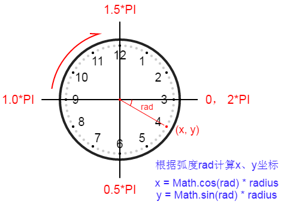

# Kotlin-KotlinAndJSClock
---
Kotlin实现Kotlin和JS的交互

## 运行效果

## 工程配置步骤：
### 1.按步骤新建工程，如下图：
	Intellij Idea——>new project——>Gradle[Kotlin(JavaScript)]

### 2.在project的build.gradle添加相应配置（如下图）:
	compileKotlin2Js.doLast {
	    configurations.compile.each { File file ->
	        copy {
	            includeEmptyDirs = false
	            from zipTree(file.absolutePath)
	            into "${projectDir}/web"
	            include { fileTreeElement ->
	                def path = fileTreeElement.path
	                path.endsWith(".js") && (path.startsWith("META-INF/resources/") || !path.startsWith("META-INF/"))
	            }
	        }
	    }
	}

	compileKotlin2Js {
		//web、clock.js皆可自定义
	    kotlinOptions.outputFile = "${projectDir}/web/clock.js"
	}

### 3.创建Kotlin类并构建生成js；创建web目录、html页面、html依赖生成的js，如下图：

### 4.所用到知识点例举：
* 核心类：
	* HTMLCanvasElement、CanvasRenderingContext2D
* 绘制线条核心代码：
	* moveTo(100.0, 100.0)//起点坐标
	* lineTo(200.0, 200.0)//终点坐标
	* stroke()//绘制线条
* 绘制圆形核心代码：
	* arc(x, y, radius,startAngle, endAngle,anticlockwise)
		* x:圆心x轴坐标
		* y:圆心y轴坐标
		* radius：半径
		* startAngle：起始弧度
		* endAngle：终点弧度
		* anticlockwise：可选参数
		* false顺时针
		* true逆时针
		* 默认顺时针

			
* 坐标计算：

	
* 当前系统时间的获取：
	
		//asDynamic()包装成js类型,关闭类型检查
    	val date = Date().asDynamic()
    	hour = date.getHours()
    	minute = date.getMinutes()
    	second = date.getSeconds()
* 更多js相关知识点，请参照[w3school](http://www.w3school.com.cn/index.html)